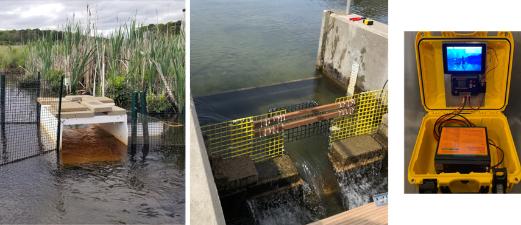
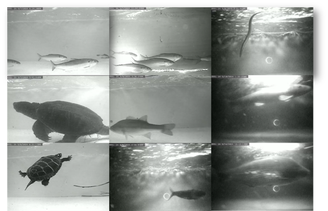
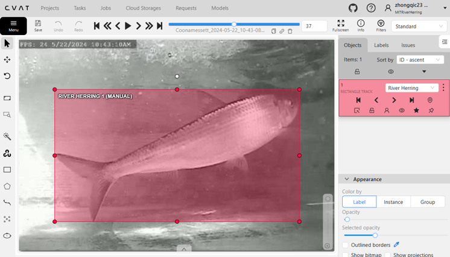
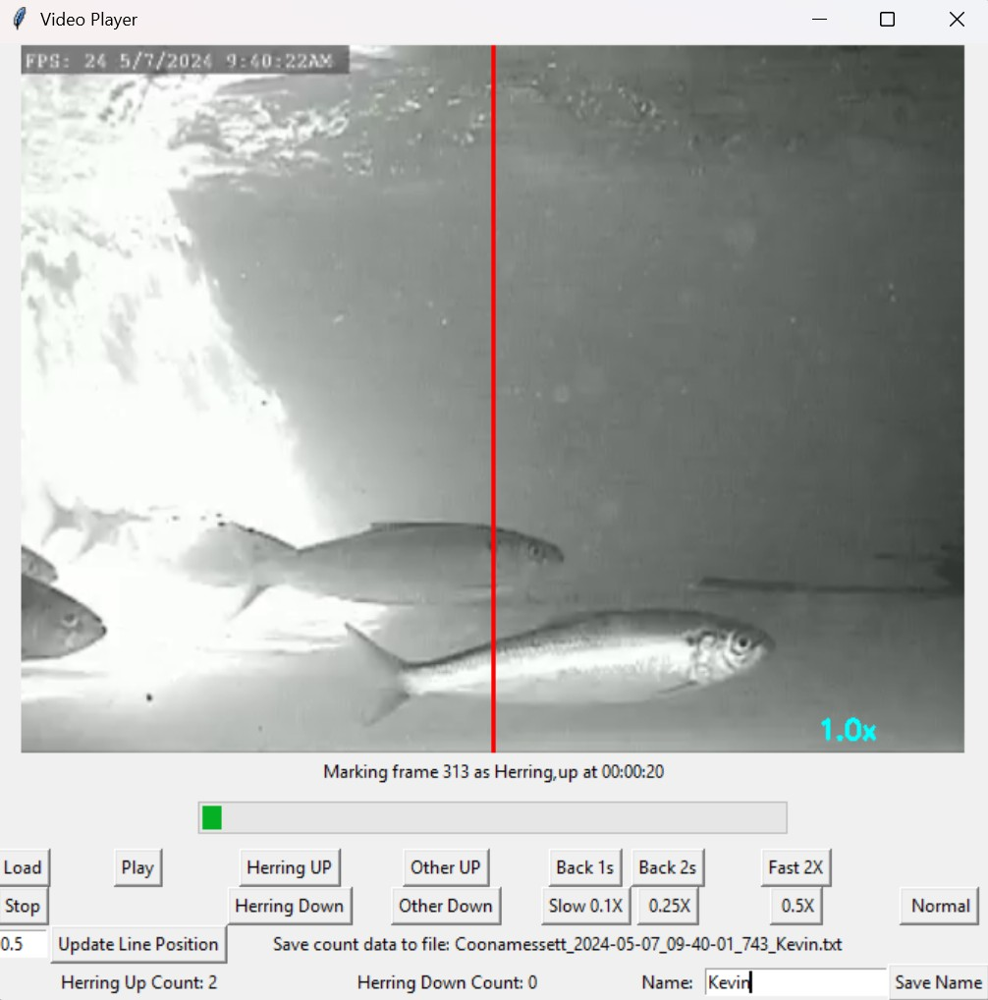
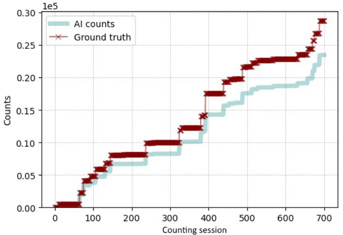
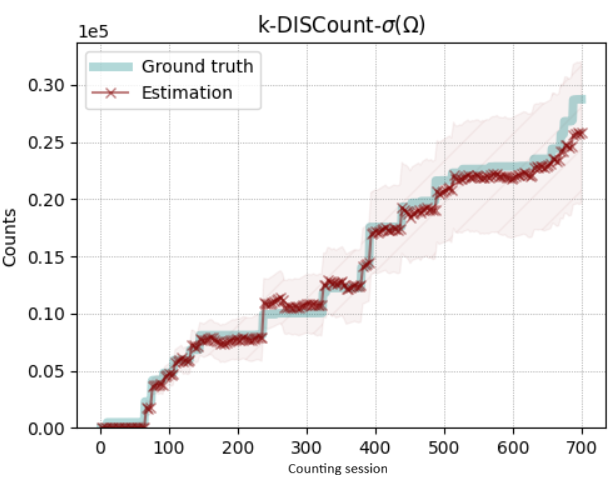

# Fisheye User Manual: Computer Vision Workflow for River Herring Migration Counting
---
## Introduction
This user manual provides a step-by-step guide to applying computer vision (CV) methods to automate river herring migration counting. The workflow integrates field video collection, video annotation, YOLO-based training, model validation, and count verification. The manual accompanies the GitHub repository that contains the code implementation.


## 1. Video Collection
Video footages are recorded using raspberry-pi based computer systems [[1]](#1) deployed at the Coonamessett, Ipswich, and Santuit Rivers. Cameras were placed in custom-built fish passage boxes or fish ladders to guide fish into the field of view, with infrared lighting for nighttime detection. Videos were recorded continuously at resolutions of 640x480 pixels at 10–25 fps. 

All video files are saved in hourly segments. 
The naming format is `site_YYYY-MM-DD_HH-MM-SS_MS.mp4`
Example: `1_2025-03-28_19-00-00_933.mp4`, `Coonamessett_2025-03-28_19-00-00_933.mp4`.

  

**Fig. 1** Field camera system setup  

  

**Fig. 2** Frame examples

## 2. Video segments for Annotation
Raw video footage may span days or even months, but CV models rely on carefully selected short excerpts that capture meaningful variation. The initial clip selection is especially critical—it often sets the tone for model training and influences downstream performance. To ensure robust annotation and model generalizability, selected segments should reflect a diverse range of conditions, including:
  * Migration intensities (from low to peak)
  * Light conditions (daytime, dusk, night)
  * Environmental scenarios (clear, turbid, rain)
  * Seasonal stages (early, peak, late migration)
  * Species diversity (target and non-target fish/objects)


 motion detect software / script. 
if pretrained weight is available, can be used to detect fish for model improvements of annotation (skip for later section for more information).

Many tools are available to take video clips. [ffmpeg](https://ffmpeg.org/about.html) is a popular tool for extracting clips. Although file naming is less important during annotation, the filenames output by this FFmpeg-based script consistently follow the same format to maintain traceability. It will also be used later for the selecting video segments for human verification of detection and fish counts

```bash
# extracts short clips from a long video file by providing start and end times in that video
# File name must match the expected format, `([A-Za-z0-9]+)_(\d{4}-\d{2}-\d{2})_(\d{2}-\d{2}-\d{2})_(\d+)\.mp4`

python src/clip_extractor.py \
  --input_file "data/raw_video/1_2024-05-09_08-00-01_794.mp4" \
  --river "Coonamessett" \
  --start "02:00" \
  --end "02:10" \
  --output_dir "data/annotation_videos/"

  # Extracted clip saved as: data/annotation_videos/Coonamessett_2024-05-09_08-02-01_794.mp4
```


## 3. Video annotation
To annotate fish detections, we used [CVAT (Computer Vision Annotation Tool)](https://www.cvat.ai/), a powerful, open-source platform designed for video and image annotation. All segments were uploaded to CVAT and manually annotated bounding boxes frame by frame. 

 

**Fig. 3** Bounding box annotation on CVAT. 
Useful link: (https://docs.cvat.ai/docs/manual/basics/track-mode-basics/) 

CVAT supports exporting annotations to multiple popular formats, making it easy to integrate with a wide range of machine learning workflows.  Annotated frames from the same video clip were exported as a zipped file in COCO format, with the filename corresponding to the CVAT task ID. This structure ensures traceability between exported datasets and their original annotation tasks.

 

Annotated Dataset from this project is available at:  https://lila.science/datasets/mit-sea-grant-river-herring/
It is also included in the Community Fish Detection Dataset (https://lila.science/datasets/community-fish-detection-dataset/). 


## 4. Splitting data to train/val/test
A metadata sheet is prepared to describe each annotated video clip, including data, time, species, number of fish. This metadata sheet is used for splitting dataset into train/validation/test. The splitting using a stratified strategy, considering classes, crowdedness (more than 20 fish in a clip), time of day (day, night, dawn, and dusk). Video frames within the same 30 min period were also ensured to be in the same group to avoid data leakage. We limited the number of empty frames used for training to five per video to reduce training time. At Santuit and Coonamessett River, the presence of other fish species was minimal (< 5%), therefore were not included in validation and testing. 

Notebooks used for splititng in `doc/notebook.notebook`

## 5. Detection model training

We chose Ultralytics YOLOv11 for its balance between accuracy and computational efficiency (Jocher & Qiu, 2024). We used the default settings and only minimum fine-tuning was required to achieve good detection performance. 

Python scripts here can also be found in `src/train_yolo11.py`.  
```python

from ultralytics import YOLO

weights_path = "weights/yolo11l.pt"
yaml_file    = "data/test_train/data.yaml"

# Load a model
model = YOLO(weights_path) 
# Train the model
results = model.train(data=yaml_file, epochs=2, batch = 8)
# Validate on the test set
model.val(data  = yaml_file, split = "test")
```

A yolo11 model pretrained using the full dataset is available (`weights/river-herring-yolo11.pt`) for river herring detection and counting. It can also be downloded from [this repository](https://huggingface.co/zhongqic/river-herring-yolo11).

## 6. Detect, track and count River Herring
The speed of processing each video mostly depending on GPU.


```python
python src/count_fish.py \
    data/raw_video/1_2024-05-07_10_06_48-355.mp4 \ # input video file
    weights/river-herring-yolo11.pt \              # model weight
    outputs/fish_count \                           # output dir for count results
    --class_id 0 \          # Class ID to count
    --save_video \          # include to save annotated video
    --tracker 'botsort.yaml' \  # tracker "bytetrack.yaml"
    --conf_thresh 0.8 \     # detection threshold
    --line_pos 0.6 \        # count line position, left - 0, right - 1
    --move_right "Upstream" \  # migration direction of fish swiming right
    --move_left "Downstream"   # migration direction of fish swiming left
```

**Batch processing**
To process multiple videos at once, list their file paths in `scripts/video_file_list.txt`. Then, run this bash script. The results for each video will be saved in a dedicated directory (named after the video file) within the specified output directory (outdir).

```bash
./scripts/batch_fish_counter.sh  scripts/video_file_list.txt weights/river-herring-yolo11.pt outputs/fish_count

# Arguments:
#   VIDEO_LIST_FILE    Text file containing video file paths (one per line)
#   WEIGHTS           Path to YOLO model weights
#   OUT_DIR           Base output directory for all results

#Options:
#   --python-script PATH   Path to process_video_cli.py (default: src/count_fish.py)
#   --class-id ID         Class ID to count (default: 0)
#   --conf-thresh THRESH  Confidence threshold (default: 0.7)
#   --line-pos POS        Line position 0.0-1.0 (default: 0.5)
#   --imgsz W H          Input image size (default: 480 320)
#   --tracker CONFIG     Tracker config file (default: bytetrack.yaml)
#   --move-right LABEL   Label for rightward movement (default: Up)
#   --move-left LABEL    Label for leftward movement (default: Down)
#   --save-video         Save annotated videos
#   --continue-on-error  Continue processing even if a video fails
#   -h, --help          Show this help message

```


## 8. Human count verification

To ensure the accuracy of CV-generated fish counts, we implemented a multi-step verification process. Each frame in which a fish crosses the designated counting line is saved to the results directory. These frames can be used to identify potential false positives. Additionally, frames containing "non–River Herring" species are stored separately to help detect false negatives. Both sets of frames can be incorporated into future rounds of annotation and model training to improve detection accuracy.

We also employed human review as a critical component of our validation strategy. Selected video segments, typically 10-minute clips in our project, were reviewed by a volunteer using a  GUI-based video player+counter tool. This interface logs the frame and timestamp when a fish is counted, allowing for comparison between human-generated and CV-generated counts.

https://github.com/zhongqic/GUI-fish-counter.git  
 

**Fig. 4** GUI fish counter. 

## 7. Unbiased count


CV models are fast, scalable, and with good accuracy, but not perfect. In crowded scenes, low visibility, or when fish overlap, the model may miss detections or count incorrectly. These limitations are visible in our figures, where dense activity or environmental noise can lead to undercounts or overcounts.

 


To address this, we used a correction method based on the work of Perez, Maji, and Sheldon (2023), called DISCount [[2]](#2). DISCount is a detector-based importance sampling framework that integrates an imperfect detector with human-in-the-loop screening to produce unbiased estimates of object counts in CV tasks. It combines automated detection with selective human review to produce unbiased and statistically corrected counts. Instead of reviewing every frame manually, DISCount uses a smart sampling strategy—spot-checking just a few key segments—to estimate the true number of fish with high confidence. This approach dramatically reduces manual effort while improving accuracy, especially in challenging conditions.
By integrating DISCount into our workflow, we ensure that our fish counts are not only efficient but also trustworthy—giving managers the confidence to make decisions based on CV generated data.

 

Detailed step-by-step tutorial on doing DISCount can be found [here](https://github.com/gperezs/DISCount/), and this [notebook](https://colab.research.google.com/drive/1bOEV7HCKZhJYfSGqCy47X0qPtgwCI85c?usp=sharing) with example from this River Herring project.


## References
<a id="1">[1]</a> Bennett, K., Vincent, R., Bennett, A., & Triantafyllou, M. (2024). Deployment of a Solar-Powered Field Camera for Monitoring Living Marine Resources. OCEANS 2024 - Halifax, 1–4.

<a id="2">[2]</a> Perez, G., Maji, S., & Sheldon, D. (2023). DISCount: Counting in Large Image Collections with Detector-Based Importance Sampling (arXiv:2306.03151). arXiv. http://arxiv.org/abs/2306.03151


